# Mac Users

### Scroll down for Windows instructions

# Setting up a FLINT RUN and Viewing Outputs

This document describes the steps required to set up the running environment, run FLINT, and access the outputs. Data preparation is described in a separate document. 

## Step 1 – Download the required software

QGIS [https://qgis.org](https://qgis.org/) (Alternatively you can use ArcGIS if you have access to it).

**(Requires OS X 10.13 and newer):** QGIS macOS Installer Version 3.22 (dmg)

To install QGIS from the DMG, hold CTRL down and select Open on the popup menu.

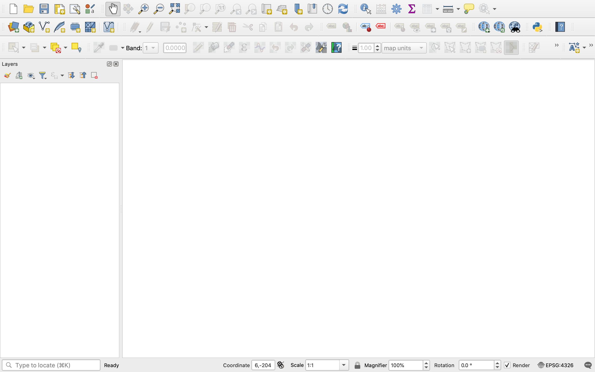

## Step 2 - Install SQLiteStudio

SQLite studio [https://sqlitestudio.pl/index.rvt](https://sqlitestudio.pl)

## Step 3 – Accessing the code from GitHub

1. Go to [https://github.com/MullionGroup/MAI.Colombia](https://github.com/MullionGroup/MAI.Colombia)

2. You should see a list of files. Above these is a ‘Code’ button. Click this button and select download zip. 

3. Download the zipped code to your computer
   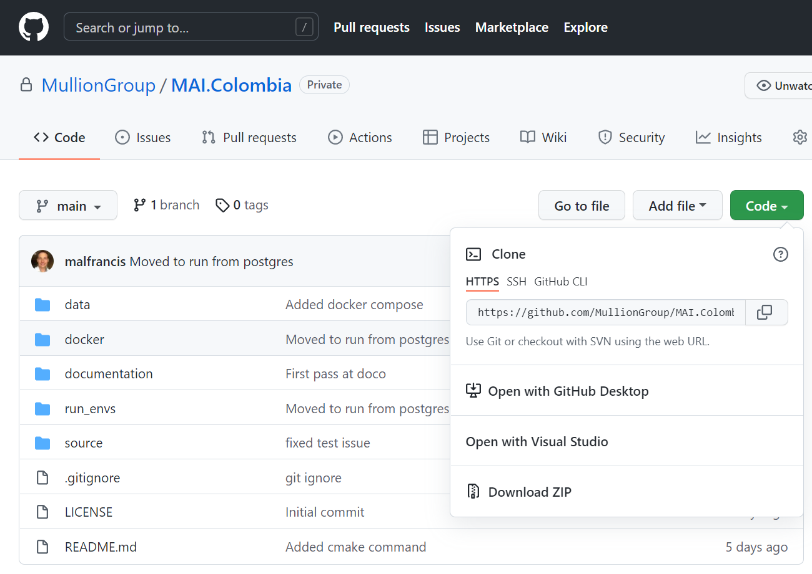

4. Generally will download to your 'Downloads' folder. Move this to your Desktop by dragging it in a Finder window. Once on    your desktop, double click or right click and use the Archive Utility. This should UnZip it in to the ‘MAI.Colombia’ folder.

5. Rename ‘MAI.Colombia-main’ to ‘MAI.Colombia’
   
   - This will match the file names in the GitHub repository (C:\MAI.Colombia)

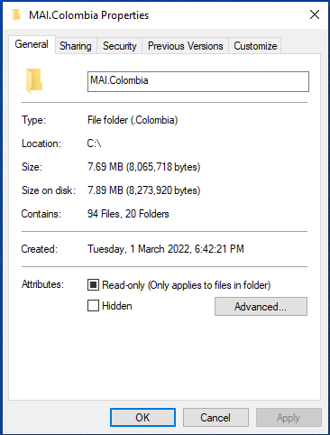

6. This step will set up the Run Environment, including the Run Configurations

7. Within the MAI.Colombia/run_envs/data folder
   
   Add the Departamentos_Orinoquia.shp and its associated files and the Forestales_2020_Orinoquia1.shp and associated files

## Step 4 – Setting up Docker

Docker hosts containers, which are like ‘light’ virtual machines that host the FLINT environment.

1. Set up a Docker Account (Docker ID, email & passwords)

2. Go to: [https://hub.docker.com](https://hub.docker.com) and choose 'Sign up for Docker'

3. Verify the email on the account

4. Go to [https://hub.docker.com](https://hub.docker.com); log in, and choose ‘Get started with Docker Desktop’ and download the appropriate installer for your system (Windows or Mac).

5. Once downloaded, Start the Docker Installer
   
    a. drag to Application folder
   
    b. Use Linux containers (Linux containers are the default)
   
    c. Your system will need to restart.

6. Through the start menu, run Docker Desktop. Open the Docker app: no hyper V or restart required. Once requested enter you Docker login (Step 10)

7. In the Mac Terminal set up the environment by:
   
   - Change the directory to the one you created by writing: 
     
     ```
     cd ~/Desktop/MAI.Colombia/run_envs
     ```
   
   - Still in Terminal, pull the container by writing: 
     
     ```
     docker pull mojaglobal/mai.colombia
     ```
   
   - Open a new terminal by going to 'Shell'>'New Window'>'Basic' and enter the following:
     
     ```
     cd ~/Desktop/MAI.Colombia/run_envs
     ```
     
     Then:
     
     ```
     docker-compose up
     ```
     
     **- Hit enter** – Download takes several minutes. You will need to wait for 5-10 minutes before moving on to the next step.

8. Go to a web browser and navigate to http://localhost:5050     Note: If this page doesn't load, it is due to the pull request not being complete, wait for       10 minutes and try again. If the issue still occurs, check on the previous processes in the terminal to ensure they ran and succeeded. 
   
   - Login to the pgAdmin 4 database network via the login page with:
     
     - USERNAME: moja@colombia.org
     - PASSWORD: admin
   
   - Once logged in, navigate to the left-hand side menu and right-click Servers. From this dropdown, select Create > Server...
   
   - Now fill out the server infomation:
     
     - In the 'General' tab, enter "colombia" into the Name field. 
     - In the 'Connection' tab, enter "postgres" into the Host name/address field.
     - In the 'Connection' tab, enter "postgres" into the Username field. 
     - In the 'Connection' tab, enter "admin" into the password field. 

9. Congratulations! You’ve now set up the FLINT environment – Time to test it!

## Step 5 – Run FLINT

10. In the Terminal Window, still in ~/Desktop/moja.MAI.Colombia/run_envs:
    
    - Write: 
      
      ```
      docker run --rm --network=moja_net -ti -v ~/Desktop/MAI.Colombia/run_envs:/tmp/moja_runenv mojaglobal/mai.colombia:latest bash
      ```
      
      **- Hit Enter**
      
      This runs a shell within the container. 
    
    - Change the directory by entering:
    
    ```
    cd /tmp/moja_runenv
    ```
    
    **- Hit Enter**
    
    - If you want to see the files in the container, you can write* ls* to list them.
    
    - Now run the build script by entering:
    
    ```
    bash ./build.sh
    ```

11. Once complete, simulate the test block config which runs a single block: 

```
moja.cli --config  growth_mai_test_block.json --config growth_mai_libs.json --config_provider growth_mai_provider.json
```

   **- Hit Enter**

To simulate all blocks, run the follwing: 

```
moja.cli --config  growth_mai.json --config growth_mai_libs.json --config_provider growth_mai_provider.json
```

**- Hit Enter**

   Note: this will take some time (10-20 minutes). 

12. Congratulations! You’re running the FLINT!
    
    a. Note: it will not let you enter anything until the run is complete.
    
    b. Once the FLINT has run, an Output folder will appear in the Data folder you created (under MAI.Colombia and will include spatial and database outputs)

## Step 6 – View Output data

13. This step shows you the commands needed to build a single raster for each output or time step of each output. We have used forestStemCM as the illustrative example. You should already be within the FLINT docker shell.  Write:
    
    ```
    python3 merge_geotiffs.py
    ```
    
    **- Hit Enter**
    
    This will produce the following outputs 

<table>
  <tr>
   <th>Output</th>
    </tr>
  <tr>
    <td>atmosphereCM</td>
    </tr>
  <tr>
    <td>aboveGroundCM</td>
    </tr>
  <tr>
    <td>belowGroundCM</td>
   </tr>
 </table>

14. Open QGIS
    
    a. When you use QGIS for the first time open; QGIS Desktop
    
    b. Open the raster output (.tif) from ~/Desktop/MAI.Colombia
    
      i. Select the drop down menu under *Home
    
      ii. Select the folder* Desktop/MAI.Colombia/run_envs/data/output/results/spatial_outputs/grids/aboveGroundCM*
    
      iii. Select *aboveGroundCM_2000.tif*
    
    c. This will show you the Spatial outputs form the Run!

15. To view the Database Output:
    
    a. Open SQLite studio
    
       i.  open the database outputs
    
          - Select add database
        
          - Select add folder
    
       ii. `~/Desktop/MAI.Colombia/run_envs/data/output/results/dbs`

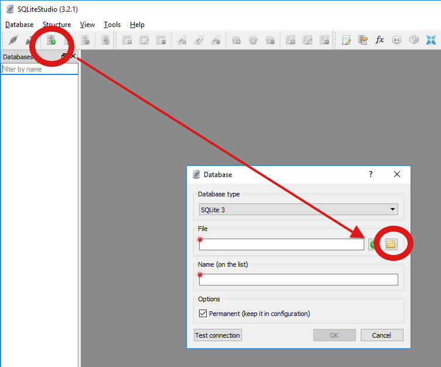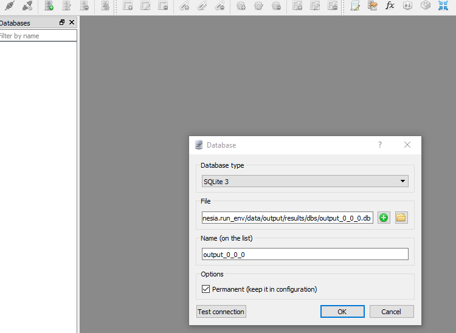

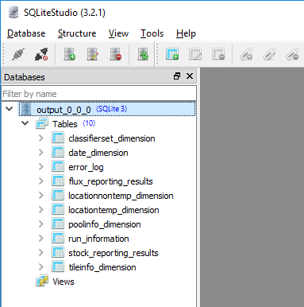

16. Open Query

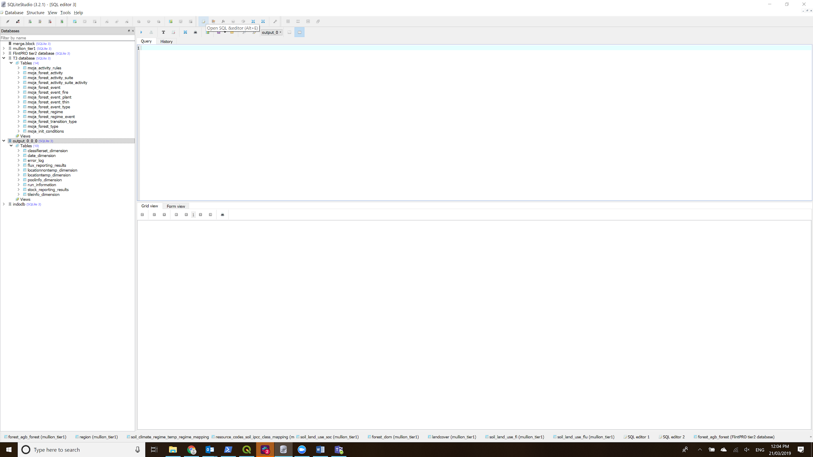

17. Load and execute the sql scripts:

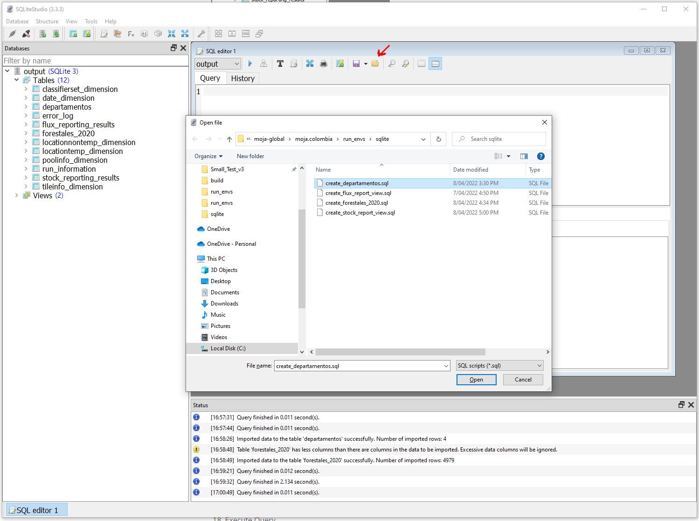

Load and execute the queries "sqlite/create_departamentos.sql" and "sqlite/create_forestales_2020.sql"

18. Import the Data
    
    Right click on the forestales_2020 table and choose import into the table
    
    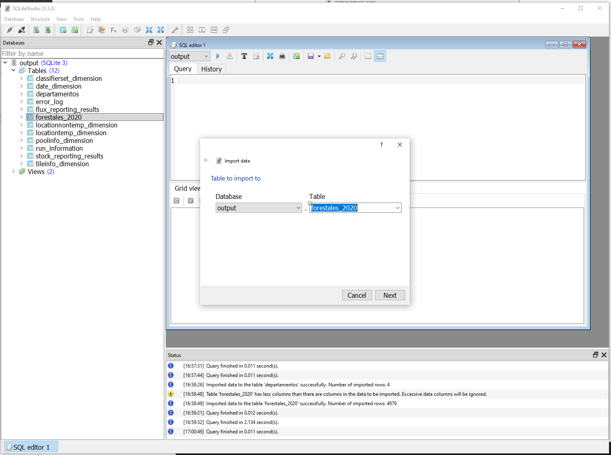
    
    choose the "run_envs/forestales_2020.csv" file that was created earlier.
    
    Right click the departamentos table and do the same with "run_envs/departamentos.csv"

19. Load and execute the view sql scripts
    
     "run_envs/sqlite/create_flux_report_view.sql" and  "run_envs/sqlite/create_stock_report_view.sql"

20. Query the views

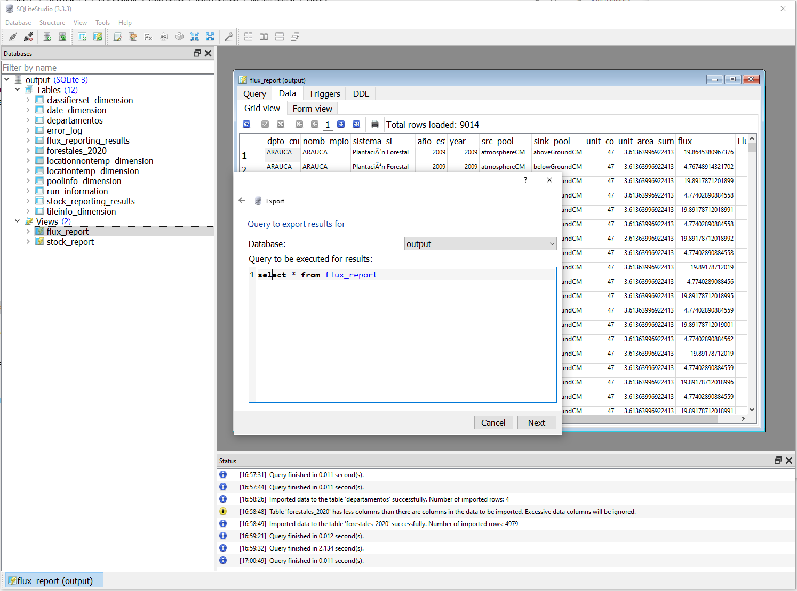

19. Export Results as json to clipboard, paste into Excel. 

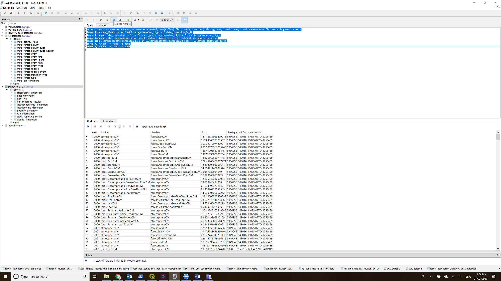

## Step 7 - Edit Config

Open  config from `C:\MAI.Colombia\run_env` using Notpad++

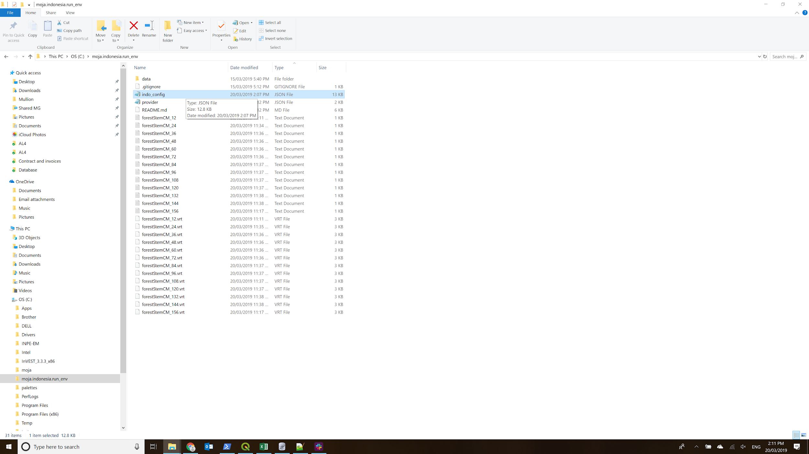

2. Determine the block index that will be analized → Modify the block_index area interest and tile_index

"Tile_index": “type the value of tile index where block index located

"block_index": *“type the value of block index”*

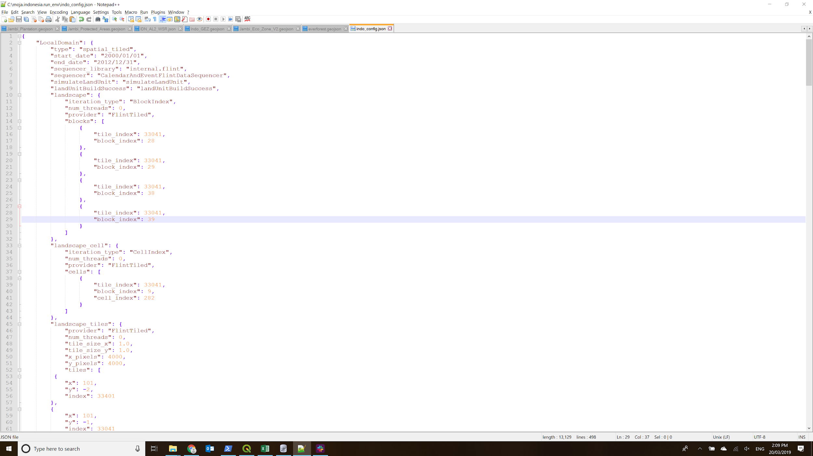

3. after Run, go to step 5.  

# Windows Users

### See above for Mac users

# Setting up a FLINT RUN and Viewing Outputs

This document describes the steps required to set up the running environment, run FLINT, and access the outputs. Data preparation is described in a separate document. 

## Step 1 – Download the required software

QGIS [https://qgis.org](https://qgis.org/) (Alternatively you can use ArcGIS if you have access to it).

Download QGIS Standalone Installer Version 3.22 (64bit) and follow install instructions.

To install QGIS from the DMG, hold CTRL down and select Open on the popup menu.


## Step 2 - Install SQLiteStudio

SQLite studio [https://sqlitestudio.pl/index.rvt](https://sqlitestudio.pl)

## Step 3 – Accessing the code from GitHub

1. Go to [https://github.com/MullionGroup/MAI.Colombia](https://github.com/MullionGroup/MAI.Colombia)

2. You should see a list of files. Above these is a ‘Code’ button. Click this button and select download zip. 

3. Download the zipped code to your computer
   

4. Unzip the folder and move the  ‘MAI.Colombia’ to C:\ (in most cases it would have automatically downloaded to the ‘Downloads’ folder and needs to be moved). 

5. Rename ‘moja.colombia-master’ to ‘MAI.Colombia’
   
   - This will match the file names in the GitHub repository (C:\MAI.Colombia)


6. This step will set up the Run Environment, including the Run Configurations

7. Within the MAI.Colombia/run_envs/data folder
   
   Add the Departamentos_Orinoquia.shp and its associated files and the Forestales_2020_Orinoquia1.shp and associated files

## Step 4 – Setting up Docker

Docker hosts containers, which are like ‘light’ virtual machines that host the FLINT environment.

1. Set up a Docker Account (Docker ID, email & passwords)

2. Go to: [https://hub.docker.com](https://hub.docker.com) and choose 'Sign up for Docker'

3. Verify the email on the account

4. Go to [https://hub.docker.com](https://hub.docker.com); log in, and choose ‘Get started with Docker Desktop’ and download the appropriate installer for your system (Windows or Mac).

5. Once downloaded, Start the Docker Installer
   
    a. Double click from downloads 
   
    b. Use Linux containers (Linux containers are the default)
   
    c. Your system will need to restart.

6. When prompted, Enable Hyper-V and Containers Features by clicking ‘Ok’ –
   
     **This will restart the computer**
   
     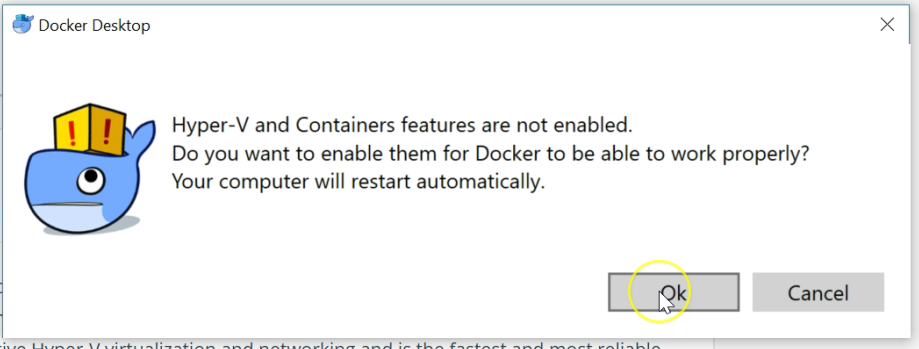
   
   8. Through the Start menu, search and open ‘Windows Powershell’
   
   9. When prompted, Allow Access through the firewall so docker can talk to the internet. 
      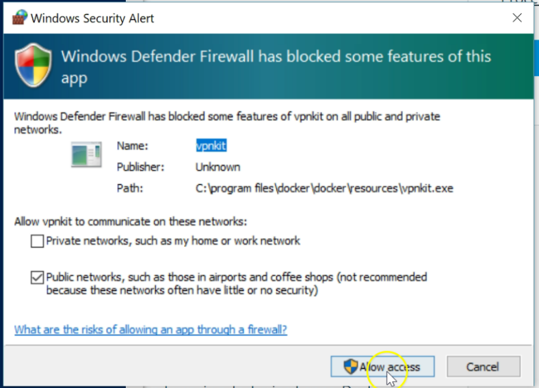 
   
   10. Log into Docker with your Docker ID or Email
       
         a. When Docker is running an icon will appear in the Windows Tool
         
       
         b. Open Docker Settings from the toolbar, Select C drive and then select Apply

Note: If you do not have administrative privileges you may not be able to set the permission for docker to access the drive. Ensure you have this access to continue. 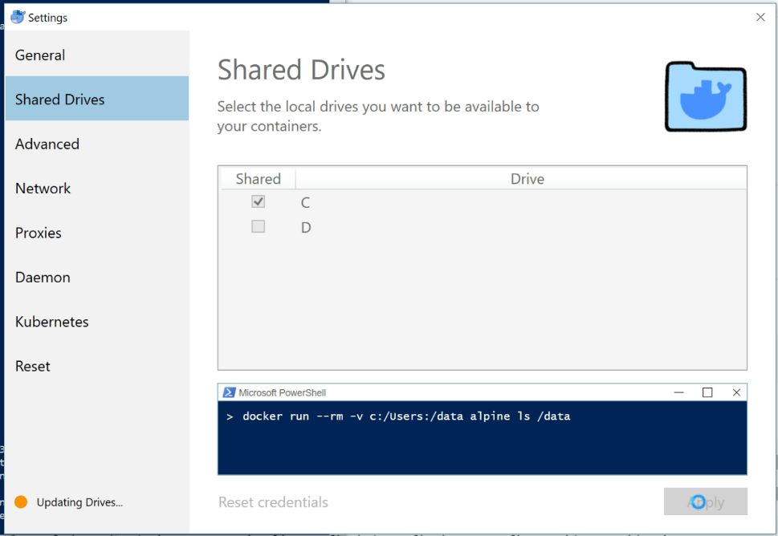

11. In the Windows Powershell set up the environment by:
    
    a. Changing the directory to the one you created by writing: 
    
    ```
    cd C:\MAI.Colombia
    ```
    
    **- Hit enter**
    
    b. Log into docker by entering: 
    
    ```
    docker login 
    ```
    
    **- Hit enter**
    
    ii. Enter your Username (Docker ID)
    
    **- Hit enter**
    
    iii. Enter your Docker ID password

**- Hit enter** (note, the password doesn’t appear on screen)

12. Still in powershell, pull the container by writing: 
    
    ```
    docker pull mojaglobal/mai.colombia
    ```
    
    **- Hit enter** – Download takes several minutes. 
    
    ```
    docker-compose up
    ```

13. Congratulations! You’ve now set up the FLINT environment – Time to test it!

14. Go to a web browser and navigate to http://localhost:5050     Note: If this page doesn't load, it is due to the pull request not being complete, wait for       10 minutes and try again. If the issue still occurs, check on the previous processes in the terminal to ensure they ran and succeeded. 
    
    - Login to the pgAdmin 4 database network via the login page with:
      
      - USERNAME: moja@colombia.org
      - PASSWORD: admin
    
    - Once logged in, navigate to the left-hand side menu and right-click Servers. From this dropdown, select Create > Server...
    
    - Now fill out the server infomation:
      
      - In the 'General' tab, enter "colombia" into the Name field. 
      - In the 'Connection' tab, enter "postgres" into the Host name/address field.
      - In the 'Connection' tab, enter "postgres" into the Username field. 
      - In the 'Connection' tab, enter "admin" into the password field. 

15. Congratulations! You’ve now set up the FLINT environment – Time to test it!

## Step 5 – Run FLINT

17. In the PowerShell Window:
    
    - Write: 
    
    ```
    docker run -ti -v C:\MAI.Colombia:/tmp/moja_runenv mojaglobal/mai.colombia:latest bash
    ```
    
    **- Hit Enter** 
    
    - This runs a shell within the container  
    - Change the directory
    - Write
    
    ```
    cd /tmp/moja_runenv
    ```
    
    - If you want to see the files in the container, you can write* ls* to list them.
    
    - Write: 
    
    ```
    moja.cli --config growth_mai.json --config growth_mai_libs.json --config_provider growth_mai_provider.json
    ```
    
    **- Hit Enter**
    
    b. Note: this will take some time (10-20 minutes). 

18. Congratulations! You’re running the FLINT!
    
    a. Note: it will not let you enter anything until the run is complete.
    
    b. Once the FLINT has run, an Output folder will appear in the Data folder you created (under MAI.Colombia and will include spatial and database outputs)

## Step 6 – View Output data

19. This step shows you the commands needed to build a single raster for each output or time step of each output. We have used forestStemCM as the illustrative example. You should already be within the FLINT docker shell.  Write:
    
    ```
    python3 merge_geotiffs.py
    ```
    
    **- Hit Enter**
    
    This will produce the following outputs 

<table>
  <tr>
   <th>Output</th>
    </tr>
  <tr>
    <td>atmosphereCM</td>
    </tr>
  <tr>
    <td>aboveGroundCM</td>
    </tr>
  <tr>
    <td>belowGroundCM</td>
   </tr>
 </table>

20. Open QGIS
    
    a. When you use QGIS for the first time open; QGIS Desktop
    
    b. Open the raster output (.tif) from `C:\MAI.Colombia` 
    
        i. Select the drop down menu under C:\
        ii. Select the folder* Desktop/MAI.Colombia/run_envs/data/output/results/spatial_outputs/grids/aboveGroundCM*
        iii. Select *aboveGroundCM_2000.tif*
    
    c. This will show you the Spatial outputs form the Run!

21. To view the Database Output:
    
    a. Open SQLite studio
    
       i.  open the database outputs
    
         - Select add database
        
         - Select add folder
    
       ii. `C:\MAI.Colombia\run_envs\data\output\results\dbs`
    
    **Mac:** `~/Desktop/MAI.Colombia/run_envs/data/output/results/dbs`


23. Load and execute the sql scripts:


Load and execute the queries "sqlite/create_departamentos.sql" and "sqlite/create_forestales_2020.sql"

24. Import the Data
    
    Right click on the forestales_2020 table and choose import into the table
    
    
    
    choose the "run_envs/forestales_2020.csv" file that was created earlier.
    
    Right click the departamentos table and do the same with "run_envs/departamentos.csv"

25. Load and execute the view sql scripts
    
     "run_envs/sqlite/create_flux_report_view.sql" and  "run_envs/sqlite/create_stock_report_view.sql"

26. Query the views


27. Export Results as json to clipboard, paste into Excel. 


## Step 7 - Edit Config

Open  config from `C:\MAI.Colombia\run_env` using Notpad++


2. Determine the block index that will be analized → Modify the block_index area interest and tile_index

"Tile_index": “type the value of tile index where block index located

"block_index": *“type the value of block index”*


3. after Run, go to step 5.  

# `
